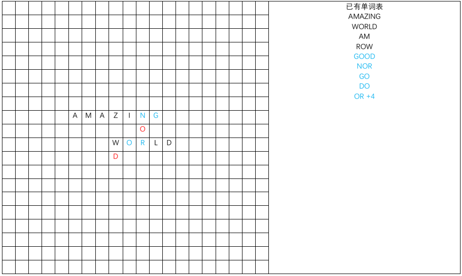
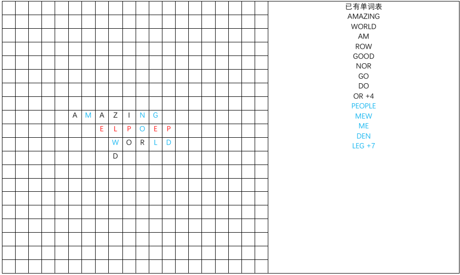

# 填字游戏

## 背景介绍

在大家喜闻乐见的填字游戏(Crossword)的基础上，littleRound进行了一些更改，创建了PVP和PVE两种玩法。

## 游戏规则

（建议结合后面的图示来理解）

### 基本概念

棋盘：20x20的方形格子，其中可以填写a-z的字母

字母：a-z

单词：一些字母的组合，不区分大小写（算作同一个单词）

字典：单词的集合，存在于字典的单词为合法的单词，在称呼单词时，除特别说明，一般是指合法的单词

已有单词表：游戏过程中的一个临时记录，也是单词的集合

动作：一个动作指游戏中一方在一个轮次按规则在格子内填写若干字母的行为

### 游戏道具

一局游戏由*棋盘*、*字典*以及一个*已有单词表*构成

游戏开始时，格子部分位置已经填好了一些随机字母，*已有单词表*中存在一些*单词*

游戏由两方交替（PVE中一方一直行动）进行，在进行一个*动作*后交换，先手权随机决定

### 合法动作

定义*构成单词*——在一次填写字母的过程中，如果使得*棋盘*上左右、上下、斜向（45度）上所有的线上的字符子串中，出现了满足下述条件的一个/些*单词*：

  		1. 存在于字典中
  		2. 任意前缀和后缀（包括自身）不存在于*已有单词表*中

则在将这个/些单词写入*已有单词表*后，称这此填写*“构成单词”*

一个满足下述条件的动作是合法的：

1. 在*棋盘*上填写字母
2. 本次填写的字母在同一条左右、上下、斜向（45度）的线上
3. 填写的字母与原来的字母在上述2中那条线上不间断
4. 填写的字母在上述条件2那条线上*“构成单词”*，且所有填写的字母参与*构成单词*
5. 至少将上述条件2那条线上的所有的*构成单词*写入*已有单词表*（这意味着，可以在其他方向上满足构成单词的条件（并未实际构成单词）而不将其写入）

### 动作得分

动作的得分由下式计算：

得分 = 参与本次*构成单词*的所有单词所使用的字母 - 填写的字母

这意味着，如果不将其他方向上满足*构成单词*条件的情况写入已有单词表，则这些单词**并不能参与记分**

### 游戏结束

游戏在指定步数（共计30个动作）或无人可以继续填写或后手方放弃（PVE随时放弃）后结束

### PVP输赢条件

在游戏结束后，双方所有动作的总分越高的获胜

### PVE版本

在PVE版本中，不是双方互搏，而是一方连续给出至多30个动作（或在30步以内停止），并计算总分

总分越高越好。

### 样例

- 初始状态

- 进行了一次合法的填写，使用了四个字母，故加四分（蓝色字母），构成单词的写入已有单词表

- 在多个方向中构成了单词，共得到七分

## 编程规范

本次希望大家编写PVE的版本

**特别注意：** 尽管规则不考虑大小写，但本次**要求**输入输出中所有字母均为大写，不使用大写导致的分数降低后果自负

### 输入格式

#### 字典文件 (words.txt)

第一行n为单词总数

接下来2-(n+1)行，每行一个单词，为字典内单词

**特别注意：** 为了削弱手玩的优势，数据集中**不含**常见单词
（为GRE高频考词，当然自信英语无敌、联想能力爆炸的同学也可以尝试手玩：D）

#### 初始局面 (example.in)

前20行：为长度为20的字符串，‘-’表示空位，A-Z表示该位置填有某个字母

第21行：一个m，表示已有单词表中的单词个数

第22-(21+m)行：每行一个单词，为已有单词表（一定合法）

### 输出格式 

#### PVE解答 (example.out)

第1行：一个T，表示共进行了多少个动作（<=30）

接下来的T组动作中，每个动作满足：
- 第1行：一个m，表示要写入的字母个数
- 第2-m+1行：每行两个数字和一个**大写**字母x, y, c，表示在坐标(x, y)写入字母c，坐标0-based
- 第m+2行：一个n，表示要写入已有单词表的单词个数
- 第m+3-m+n+2行：每行一个单词（全大写），表示要写入的单词

### 提交

这是一道**提交答案题**

提交example.out文件的内容

提交错误的格式**会导致总分为-1**

## 评分方式

非法动作**会导致总分为-1**

30轮内结束后的总动作分数。

提交默认的out文件可得到13分，**相当于0分**

**特别注意：** 本次机考中【B卷分数<14】**视为未参与B卷考试**